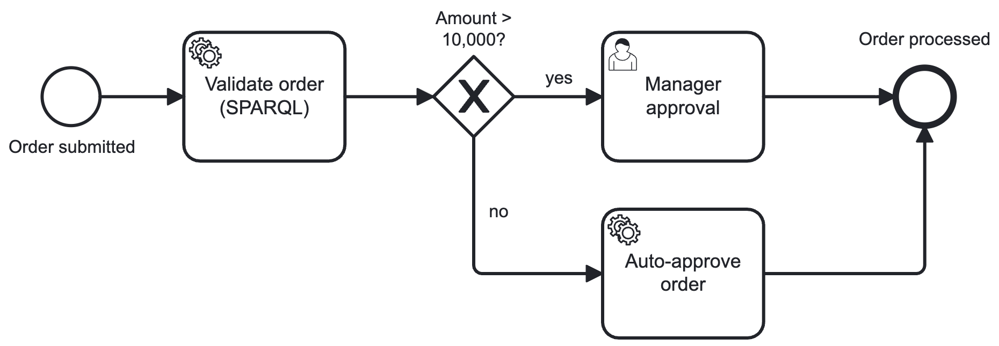
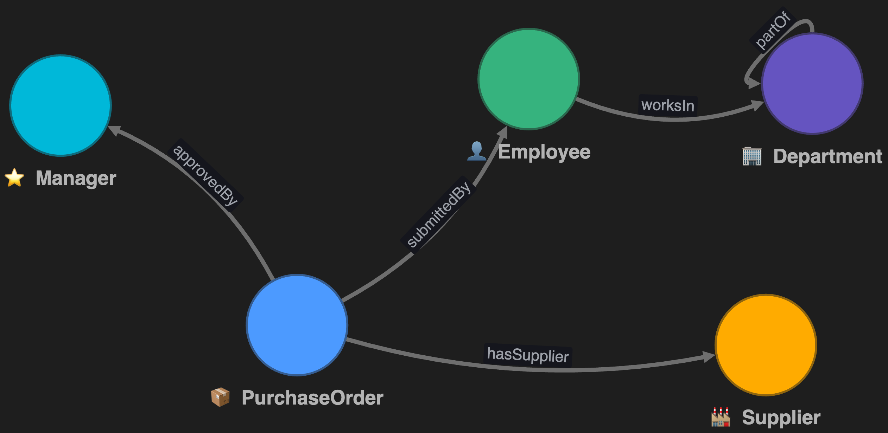

# decision-ontology-workflow-lab

A minimal but complete, consistent teaching package for ontology-grounded
decision workflows: one business rule, expressed in a BPMN process, an OWL
ontology, and a small relational dataset — wired into two implementation
variants (Stardog Cloud and Microsoft Fabric IQ + Foundry IQ agent), plus a
Stardog-only reasoning layer.

Technology scope: Microsoft (Ontology Playground, Fabric IQ, Foundry IQ,
Power BI), Stardog (Cloud Free: Studio, Designer, Explorer), Python
(pystardog, martinlab-utils), BPMN (Camunda BPM 7 / CIB seven), CSV and plain
SQL.

**Business rule:** Orders with an `amount` above 10,000 require approval by a
*Manager*; orders at or below 10,000 are auto-approved.



## Repository structure

## Repository structure

```text
decision-ontology-workflow-lab/
├── README.md
├── LICENSE                         # MIT
├── .gitignore
├── .env.example                    # credential variable names (no values)
├── process/
│   └── purchase-order-approval.bpmn
├── ontology/
│   ├── procurement-ontology.rdf
│   └── procurement-rules.ttl       # Stardog-only reasoning layer
├── data/
│   ├── departments.csv
│   ├── employees.csv
│   ├── suppliers.csv
│   └── purchase_orders.csv
├── db/
│   └── schema.sql
└── notebooks/
    └── validate_order_worker.ipynb # runnable worker for variant 1c
```

## Artifacts

| File | Purpose |
|---|---|
| `process/purchase-order-approval.bpmn` | BPMN 2.0 process for Camunda BPM 7 / CIB seven: external service task `Validate order (SPARQL)` (topic `validate-order`), exclusive gateway (the decision), user task `Manager approval`, service task `Auto-approve order` (topic `auto-approve`). Opens in Camunda Modeler or bpmn.io. |
| `ontology/procurement-ontology.rdf` | OWL ontology (RDF/XML). `ont:` annotations (isIdentifier, cardinality, icon, color) follow the Ontology Playground / Fabric IQ conventions; `map:` annotation properties document the DB binding. Reasoning axioms (subclass, transitive `partOf`) are inert in flat tools. |
| `ontology/procurement-rules.ttl` | Stardog-only rule layer (Stardog Rule Syntax): derives `:HighValueOrder` and `:ApprovalViolation` memberships at query time. Not imported into the Playground / Fabric IQ. |
| `data/*.csv` | Instance data (English). FK integrity holds; `departments` includes a 3-level hierarchy (`parent_id`) for transitivity demos. |
| `db/schema.sql` | Matching relational schema incl. `CREATE DATABASE` (server-side; skip that section for the SQLite/sql.js import). Table names = CSV file stems = `map:sourceTable` values. |
| `notebooks/validate_order_worker.ipynb` | Runnable external-task worker for variant 1c (Deepnote-ready, env-var based). |

Naming conventions: table `purchase_orders` ↔ class `PurchaseOrder`; column
`amount` ↔ property `amount`; PK column `id` ↔ `{Class}Id`; column `name` ↔
`{Class}Name`; `Manager` instances come from `employees` with row filter
`is_manager=true` (or are inferred — see 1d).

---

## Business Process (Worflow) and Ontology

### 0a. Extend the BPMN model

The process model already contains the two extension points — no code here,
pure modeling (Camunda BPM 7 / CIB seven external-task pattern):

- `Validate order (SPARQL)`: **external service task** with topic
  `validate-order`. The process engine only sees a topic; the implementation
  is provided later by the Python worker (variant 1c).
- `Manager approval`: **user task** for the human decision — the point where
  the Foundry IQ agent (variant 2f/2g) supports the approver.

Open `process/purchase-order-approval.bpmn` in Camunda Modeler or bpmn.io and
inspect the gateway conditions `${amount > 10000}` / `${amount <= 10000}` —
the same rule reappears as SPARQL (1c), as a Stardog inference rule (1d), as
a Fabric IQ rule (2d) and in the agent's system prompt (2g).

### 0b. Import and explore the ontology in the Ontology Playground

Fastest start — no import needed: [open the ontology directly in the
Playground](https://microsoft.github.io/Ontology-Playground/#/share/eJytWF2OG7kRvkqh8yIBLUWbtXezGiTB_FjwYHc9jsdOHjKGUeouqbnDJtskW3LD2DNkFzlAgCDI214qJ8gRkmL_kC3NeHZjv0lsssiv6quqj3yfaOW01NsmWb5PFJaULJPnRme1oZKUg6v-c5rkZDMjKie0SpbJS8KsEGoLvQHYaAOuIHhem6xAS3BlcjJwWlVG71DCXpvbjdT7OZzVViiyFkwtaQma51nYC1cAKsBS18oBrvWO4LNFulgswNDbWhiCEhVuyQD2RieWCLboaI8N3CSn7drfd-v-cJOAUFB1J5r5nWb94vm6KtV0Di8Lght2xPImAVRKO2SQFibCXuaknNgIMilkaHKhUArXpCAyrVLItNRmChstpd579L3D4LnEZmt0rXL4NaxwbUQGl3-EFxcryLTasVmt7IlfdJOUWI13h8roiowTZHlj0_iJOTpcs2_XQuXs_YnDtSR_kLpUKRi9h42QjvypDGDtdIlOZFBiVfGKLSkyfos5vCC0Wgm1nRmStEN2-zuhSwsTW68zidam4AwqK5zYCddMAQ2BUGQcO3Yj0YHTWtplG_qAGVUeoRZlpY3zc0h6Zlk_Q2yVNuTH241P4NqhyfUWakuWP5RtjKtAyhnTxs6dkwPneAQkNmSm8yRN2LmuedlUZJPlX94nIk-WSc8CT8skHdh-MDym-elAnpamYOt1KZyjHNYNs5XKSuqGCJwGBFtXlRRk5i357c9j8QnYEqUk06cCO5kj11GVcgbFjPsfjP_8_W__StLEMy9ZJr96dP7V6WqVpEkgjMfcwfMWL_MkTVxT8YBQjrYeaczuZOlMTYfoXynxtiYQwzTQG8BDl0wqI0o0DdxSwxP6z29aNNN58n06nKfN7nCcnDJRojyuL9qh7DboKoJQPtZZbQyprIGt2JHiMIxGOzc0c7gwYtdyKNQL3s5yek1cYcgWWuZddKaekDy5Z6AnlSuQd95wWJ6KbfEnlHXLFSipXJOxhahGCPuTBIzWGaG2RxAvr6_g0W8--zKcPdM5sQf5FDH0FGi-ncP501UKT169SOHV9cVoz7c1esrfFebxps9qPjRvUivhbLsNEyyy5scu0FEUpvbf2BZPic66RxvSY2TQOnS1fdAh34gNZU0mCdoFI1csoSJf81LoswK0AUPfUdbu95p39KneJ2XI8idh5CjByVg9JHI-EEqXFaoG9oWGDFWH7ID7dpSYP_4zTszPvzj7_Msn9yZmf8ZPm5tRQTpMy_7DQUL2w8_470MRWtVSAi_sQ9OvPjCJQj5o68_a3IKfCpjnhvXAh4wWwtAv4eTgh--0UJTHMT0BUtw2LVhSQhvhGnhbkxFkRzTq6nRg0bfDwAGJIre3MqavN1i7wm8wh-uuozLKno5LEMo6VBm1RX-IUWtG2Dd9r_gdeBKA1WB81-aC5OtS2ySdhnW8Hi3sSco5XKpRUduhEcgVpcMSVTFPc5TWW5K0cVArVg3UdnO_maEcNkaXbddFtfVM6BPyrIny4d8__RCnw2Jx9tuLr-5Nhw7nJ-5UndUTsMzZHddusBVmxP4JGZiCFSobGvNhLCbDz7nIYV8Qa6DD0ExH1OmFQODOdRg5rEB9qfG9JicpdnyGrdY512ewZHYiI9sqVdZuLPwWs8fTgcdG2Nuewl2zKMS2mLWIO1Xh4yb1fmaQ9Ut_xHEN--tPcdBWq9OzxeLeoPUmPnHUerNHJWw48riE9cM_q4Q9i6rXsFEXgXEf585rHm7j5-28jhcjs8ICq_VxM2wD-LAC6gnTR9yHbzFfwKTSfOlwGh7zP3qXkZSk3PSERXPuRbEnBCqUjRW-4hzRYUTXnCo0jsV1IOxFPHZU77TZohLWXyRQejERbnBK1ShjyQ7rOt-Sm0MwavmcJSAUggyarGhgJxD489UGJsOtg6Zjfv4j5ucXjx8_Or-fnwHWJ2ZoMHzE0fDpgKXhwy_maVg6stg69WEmnd4Xj2P7LLLPn65OOCPWvm_6oPKkEJE-SCFywg2lqLNstJR1NWqrr9PEkGzv1oWooqvZoBrPmsC_8SCz_45LnNNjuRfd0dum0sycnml1LBS-EeqWL6GdeHV6rBpY9oW7nnAwWX19eLOZDxPesGjUEPeJLvgeX-iPAd5o7EPoggr5WHB9w2Jsd2loEG7OuiBHp037oKPvuMbe5Yne3B2OSENb1Uo20-jZAXIq9TLSEr0okeTsIFlaldMZKbTOI8nRvRvp2gG9q6TIhAPX8ENH5P4C7fVRPx4PfigAUS__mAjwbSt0tjvZ1H58I3KeH_rzmEz8jmYvVUASBjoUUT54AKPq_n9AiN84XEHCjOrf6uso3OFDhyIqhwc42iISYAz_OxSjU38MjqtxqwpVa01uT6TiM3o48ZkrNPeDgQvKJLImDsVxOeYti_RcGMpcrLQxM9pakLQjaU-ih7L-DeKuZ8ToES2uo4cPafF7Xfuq1rb6pHsz5Lr7-vv_AlxRwCY)
(the ontology state is encoded in the URL fragment — no backend involved).

Manual import and exploration:

1. Open the [Ontology Playground](https://microsoft.github.io/Ontology-Playground/).
2. Import/Export → import `ontology/procurement-ontology.rdf`.
3. Explore: identifiers render with the 🔑 icon, relationships show
   cardinalities (note the self-relationship `partOf` on Department), classes
   show their icons/colors. Validation should report no issues.
4. Optional: re-export as RDF/XML — the round-trip stays Fabric-IQ-compatible
   for variant 2. The transitivity axiom and the subclass axiom are ignored
   by the flat model — by design.



---

## Variant 1 — Stardog Cloud

All steps run in Stardog Cloud (free tier suffices: 1M edges, 3 databases).

### 1a. Ontology import (Designer)

1. In **Studio**: create a database `procurement`, then load
   `ontology/procurement-ontology.rdf` via the Database Hub (Load Data). Load
   it into the schema graph `tag:stardog:api:context:schema` so Designer can
   see it; the RDF/XML format is detected automatically.
2. In **Designer**: click the plus icon next to *Data Models* and import the
   model from the endpoint (server → `procurement` → schema). Alternatively,
   upload the model as a `.ttl` file directly in Designer.
3. If you build the model by hand instead, set the model namespace to
   `http://example.org/procurement#` (Designer's default is
   `tag:stardog:designer:<project>:model:`).

### 1b. CSV → graph mapping (Stardog Cloud, no code)

1. In Designer, add the four CSVs from `data/` as data sources (upload).
2. Map each CSV to its class: select the identifier column (`id`), the label
   and the attributes (`amount`, `currency`, `rating`, …); map the FK columns
   (`submitted_by`, `supplier_id`, `approved_by`, `department_id`,
   `parent_id`) as relationships. Designer suggests mappings in preview mode.
3. **Reasoning setup choice:** map `employees.csv` only to `Employee` and do
   *not* map a `Manager` subset — in 1d, Stardog will infer managerhood from
   the range of `approvedBy`. (Mapping the subclass explicitly via the
   `is_manager=true` filter is the alternative; compare both in class.)
4. **Publish** the project to the `procurement` database — publishing
   materializes the mapped data as RDF.
5. Verify in Studio or Explorer with query 1 from the gallery below
   (expected: orders 1002, 1004, 1006 on the manager path).

### 1c. External task worker with SPARQL (Deepnote notebook)

The implementation behind the BPMN topic `validate-order`, using
`martinlab-utils` for the Camunda BPM 7 / CIB seven external-task client and
`pystardog` for the rule check. Runnable version:
`notebooks/validate_order_worker.ipynb`. Credentials live in Deepnote
environment variables (Project settings → Environment variables; see
`.env.example` for the variable names).

```python
# pip install martinlab-utils pystardog
import os
import stardog
import martinlab.camunda as cam

# --- connections (Deepnote env) ---
CONN = {
    "endpoint": os.environ["STARDOG_ENDPOINT"],    # https://<instance>.stardog.cloud:5820
    "username": os.environ["STARDOG_USERNAME"],
    "password": os.environ["STARDOG_PASSWORD"],
}
CAMUNDA_ENGINE_REST = os.environ["CAMUNDA_ENGINE_REST"]  # e.g. http://<host>:8080/engine-rest
TENANT_ID = os.environ.get("CAMUNDA_TENANT_ID")    # optional

# --- the business rule as a query ---
# A violation is a high-value order WITHOUT a manager approver.
ASK_VIOLATION = """
PREFIX : <http://example.org/procurement#>
ASK {{
  :purchase_orders/{oid} a :PurchaseOrder ; :amount ?a .
  FILTER(?a > 10000)
  FILTER NOT EXISTS {{ :purchase_orders/{oid} :approvedBy ?m . ?m a :Manager }}
}}
"""

def validate_order(task):
    order_id = int(task.get_variable("orderId"))  # adapt to martinlab-utils task API
    with stardog.Connection("procurement", **CONN) as conn:
        violation = conn.ask(ASK_VIOLATION.format(oid=order_id))
    return {"orderId": order_id, "valid": not violation}

# --- worker ---
worker = cam.Client(CAMUNDA_ENGINE_REST)
worker.subscribe("validate-order", validate_order, TENANT_ID)
worker.polling()
```

Expected behaviour with the sample data: order **1006** → `valid: False`
(pending, 15,250 CHF, no manager assigned); order **1001** → `valid: True`
(below threshold); order **1002** → `valid: True` (approved by a manager).
With reasoning enabled (1d), the `?m a :Manager` check works even though no
manager is explicitly typed in the mapped data.

Note: Stardog's built-in NL interface (Voicebox) requires a paid tier; the
free tier is queried via SPARQL/pystardog as shown.

### 1d. Reasoning (Stardog only — the differentiator vs. Fabric IQ)

Stardog infers new facts at query time; Fabric IQ and the Playground do not
reason and simply ignore the corresponding axioms — which is exactly why the
package stays compatible. Setup:

- Reasoning type `SL` (the database default) covers RDFS/OWL 2 profiles plus
  user-defined rules.
- Enable reasoning per query: Studio *Reasoning* toggle, HTTP parameter
  `reasoning=true`, or in pystardog `conn.select(query, reasoning=True)`.
- Load the rule layer: `ontology/procurement-rules.ttl` into the
  `procurement` database (Studio Load Data or
  `conn.add(stardog.content.File(...))`) — Stardog detects IF/THEN rules in
  Turtle files automatically.

| # | Demo | Mechanism | Reasoning OFF | Reasoning ON |
|---|------|-----------|---------------|--------------|
| R1 | Who is a manager? | `approvedBy` has range `Manager` | 0 rows (Manager never mapped) | Alice Smith, Dave Brown (inferred) |
| R2 | Managers are employees | `Manager rdfs:subClassOf Employee` | managers not in `:Employee` | included |
| R3 | Department hierarchy | `partOf` is transitive | direct parents only | full closure (5 → 1 → 4) |
| R4 | High-value classification | SRS rule 1 | no `:HighValueOrder` members | orders 1002, 1004, 1006 |
| R5 | Approval violations | SRS rule 2 (composes with R1 + R4) | none | order 1006 |

```sparql
-- R3: departments belonging to Corporate, directly or indirectly
PREFIX : <http://example.org/procurement#>
SELECT ?name ?budget WHERE {
  ?d :partOf :departments/4 ; :departmentName ?name ; :budget ?budget .
}
-- OFF: Procurement, Engineering, Finance (direct children)
-- ON:  + Indirect Procurement (via Procurement)

-- R3b: budget rollup over the hierarchy
PREFIX : <http://example.org/procurement#>
SELECT (SUM(?b) AS ?totalBudget) WHERE {
  ?d :partOf :departments/4 ; :budget ?b .
}
-- OFF: 900,000 | ON: 980,000

-- R4/R5: rule-derived classifications
PREFIX : <http://example.org/procurement#>
SELECT ?o WHERE { ?o a :HighValueOrder }       -- ON: 1002, 1004, 1006
SELECT ?v WHERE { ?v a :ApprovalViolation }    -- ON: 1006
```

Punchline for the course: with rule 2 loaded, the validation check in 1c
collapses to `ASK { :purchase_orders/1006 a :ApprovalViolation }` — the
business logic moves from the query into the knowledge graph itself. The
derived classes `:HighValueOrder` and `:ApprovalViolation` are deliberately
*not* declared in `procurement-ontology.rdf`, so the Playground/Fabric IQ
import stays clean (declared entity types there require identifiers and
bindings).

Compatibility notes: the Playground and Fabric IQ import `partOf` as a normal
self-relationship and ignore `owl:TransitiveProperty`; the subclass axiom is
likewise ignored by flat models. The rules file is Stardog-specific (SRS;
Stardog can translate to SWRL where expressible).

---

## Variant 2 — Fabric IQ + Foundry IQ agent (current preview)

### 2a. Prepare the data (lakehouse)

1. In Microsoft Fabric, create a lakehouse `procurement` (Fabric capacity and
   the IQ preview tenant settings must be enabled).
2. Upload the four CSVs from `data/` to the lakehouse *Files* area.
3. **Load to tables**, so the tables `departments`, `employees`, `suppliers`,
   `purchase_orders` match `db/schema.sql`.

### 2b. Load or generate the ontology

- **Primary path — import:** import `ontology/procurement-ontology.rdf` into
  a new ontology (preview) item; the file follows the Playground/Fabric IQ
  RDF conventions (`ont:isIdentifier`, `ont:cardinality`, …). If the import
  option is not available in your tenant's preview build, recreate the model
  manually — the Playground (0b) serves as the visual blueprint.
- **Alternative — generate:** build a Power BI semantic model over the four
  lakehouse tables (see 2c) and generate the ontology from it, then refine
  entity types, keys and relationships.
- Either way: **bind** each entity type to its lakehouse table — the key
  column on the source side must match the entity key (e.g.
  `purchase_orders.id` ↔ `orderId`).

### 2c. Optional: Power BI dashboard

Build a small dashboard on a semantic model over the lakehouse tables:

- KPI card: count of high-value orders (`amount > 10000`)
- Bar chart: order amount by supplier country
- Matrix: budget vs. actual spend per department
- Table: pending orders with submitter and supplier rating

Bonus loop: the same semantic model is the input for ontology generation in
2b — a nice demonstration that semantic model and ontology are two views of
the same business vocabulary.

### 2d. Define the business rule in the ontology

Fabric IQ ontology rules define **conditions and actions on business
entities** (not on raw tables); they are evaluated by **Fabric Activator**,
which monitors the bound data and triggers actions when conditions hold:

1. On entity type `PurchaseOrder`: **⋯ → Add and view rule → View rules →
   Add rule**.
2. Condition: `amount > 10000` **and** `approvedBy` is empty (status
   `pending`).
3. Action: Activator alert — Teams message or e-mail to the responsible
   manager ("Order {orderId} requires your approval").
4. Save (rules are stored in a Fabric Activator item) and start the rule with
   the toggle.

This is the same business rule in its fourth formalism — after the BPMN
gateway (0a), the SPARQL ASK (1c) and the Stardog rule (1d). Comparison
point for class: the Fabric IQ rule is *reactive* (fires on data changes),
while the SPARQL check is *on demand* and the Stardog rule is *deductive*
(derives a classification).

### 2e. Explore with the built-in ontology graph

1. In the ontology item, select entity type `PurchaseOrder` → **View entity
   type details**: the **Instances** tab shows the real rows from the
   lakehouse; the **Overview** page gives data previews.
2. Open the **graph view** (expand a graph tile — powered by Graph in
   Fabric): start at order 1006 and expand to its supplier, submitter and
   (missing) approver.
3. Try the **Query builder** to filter across entity types without writing
   SQL joins — e.g. high-value orders from suppliers with rating below 3.5.

### 2f. Build a Foundry IQ agent grounded in the ontology

Prerequisites: an Azure subscription with a Foundry project; a Fabric
workspace containing the ontology item; the AI Search role *Search Index Data
Contributor* assigned to the Foundry project's managed identity (otherwise
the agent fails with a 403); Edge or Chrome, signed in with an identity that
can access both the Foundry project and the Fabric workspace.

1. Foundry portal → **Knowledge → Knowledge bases → + New knowledge base** →
   knowledge type **Fabric IQ**.
2. In the embedded **OneLake catalog**, browse to your Fabric workspace and
   select the ontology item (only items your identity can read are visible).
3. Give the knowledge source a name and a description of the business domain.
   Then configure the knowledge base: the **description** is used by the
   agent at runtime to decide when to consult this knowledge base — write it
   from the agent's point of view, e.g.:

   ```text
   Procurement domain: purchase orders with amounts, currencies and statuses,
   the employees who submit them, the managers who approve them, suppliers
   with ratings, and departments with budgets. Consult this knowledge base
   for any question about orders, approvals, suppliers, or procurement
   budgets.
   ```

   Example retrieval instruction: *"Only return answers supported by the
   ontology data; combine entities via their relationships when needed."*
4. Save the knowledge base and validate it with test queries.

### 2g. System prompt and example user prompts (Manager approval task)

Create the agent: **Agents → + New agent** → name `procurement-approval-agent`,
pick a model deployment, paste the system prompt, then **Knowledge → + Add
knowledge** → select the knowledge base from 2f. Save and test in the **Chat**
pane; iterate on the system prompt and the KB description if the agent skips
the knowledge base or produces ungrounded answers.

**System prompt (agent instructions):**

```text
You are the Procurement Approval Assistant supporting managers in the
"Manager approval" step of the purchase order workflow.

Business rule: orders with an amount above 10,000 (any currency) require
approval by a Manager (relationship approvedBy). Orders at or below 10,000
are auto-approved and never reach this task.

When asked about an order or pending approvals, always report: order id,
amount and currency, supplier (name, country, rating), submitting employee,
and status. Flag orders above 10,000 from suppliers with a rating below 3.5
as RISK. Answer only from the connected ontology data; if information is
missing, say so explicitly. Never invent orders, people, or approvals.
```

**Example user prompts:**

```text
Which pending orders still need manager approval?
Show order 1006: amount, supplier, supplier rating, and who submitted it.
Are there high-value orders from suppliers with a rating below 3.5?
Which managers approved orders in August 2026, and what is the total amount per manager?
List all orders above 10,000 without an approver, grouped by supplier country.
```

---

## SPARQL query gallery

```sparql
-- 1. The BPMN decision as a query: which orders take the manager path?
--    Expected: 1002, 1004, 1006
PREFIX : <http://example.org/procurement#>
SELECT ?order ?amount ?currency ?manager WHERE {
  ?order a :PurchaseOrder ; :amount ?amount ; :currency ?currency .
  OPTIONAL { ?order :approvedBy ?manager }
  FILTER(?amount > 10000)
} ORDER BY ?order
```

```sparql
-- 2. Rule violations (the check behind "Validate order (SPARQL)").
--    Expected: 1006. In Stardog, run with reasoning=ON so that
--    "?m a :Manager" is inferred from the range of approvedBy.
PREFIX : <http://example.org/procurement#>
SELECT ?order ?amount ?status WHERE {
  ?order a :PurchaseOrder ; :amount ?amount ; :status ?status .
  FILTER(?amount > 10000)
  FILTER NOT EXISTS { ?order :approvedBy ?m . ?m a :Manager }
}
```

```sparql
-- 3. Risk analysis: high-value orders from low-rated suppliers.
--    Expected: 1006 (Global Office Supplies, rating 3.1)
PREFIX : <http://example.org/procurement#>
SELECT ?order ?amount ?currency ?name ?rating WHERE {
  ?order a :PurchaseOrder ; :amount ?amount ; :currency ?currency ;
         :hasSupplier ?s .
  ?s :supplierName ?name ; :rating ?rating .
  FILTER(?amount > 10000 && ?rating < 3.5)
}
```

```sparql
-- 4. Reasoning demo: managers are employees (Manager rdfs:subClassOf Employee).
--    With reasoning enabled, Alice Smith and Dave Brown appear even where
--    only typed as :Manager (or only inferred via approvedBy).
PREFIX : <http://example.org/procurement#>
SELECT ?person ?name WHERE {
  ?person a :Employee ; :employeeName ?name .
} ORDER BY ?name
```

## Teaching notes

- The same rule now lives in **five** formalisms: BPMN gateway conditions
  (`${amount > 10000}`), the SPARQL ASK in the external task worker, the
  Stardog inference rule, the Fabric IQ rule (Activator), and the agent's
  system prompt. Comparing deterministic (process, query, rule engine) vs.
  reactive (Activator) vs. probabilistic (agent) rule enforcement is the core
  exercise.
- Reasoning is the clean Stardog-vs-Fabric-IQ contrast: same files, same
  data — but only Stardog derives new facts (subclass, range, transitivity,
  rules).
- Edge cases in the data: order 1005 (9,999.99 — just below the threshold),
  order 1006 (pending high-value, low-rated supplier — the risk case and the
  rule violation), order 1004 (rejected by a manager).
